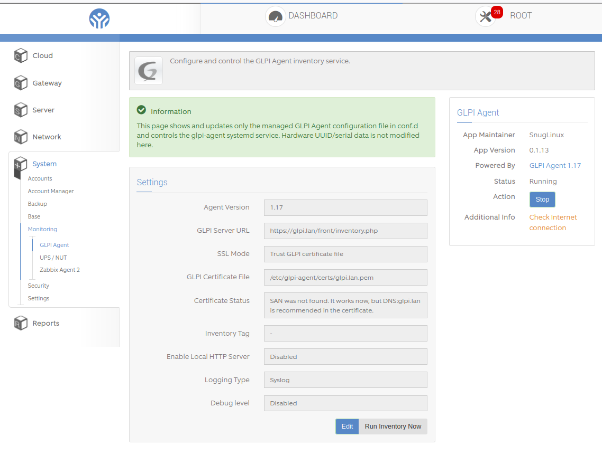

# app-glpi-agent

ClearOS Webconfig app for configuring and controlling the **GLPI Agent** inventory service.

The app is intentionally conservative: it manages only its own GLPI Agent configuration file in `conf.d/`, controls the `glpi-agent.service` systemd service, and provides safe Webconfig actions for inventory and certificate handling.

## Screenshot

<p align="center">
  
</p>

## Features

- Shows the installed GLPI Agent version.
- Configures the GLPI server inventory URL.
- Supports SSL modes:
  - system CA trust;
  - trusted GLPI certificate file via `ca-cert-file`;
  - SHA256 fingerprint;
  - no SSL check.
- Can update and verify the GLPI HTTPS certificate from Webconfig.
- Enables or disables the local GLPI Agent HTTP server.
- Configures HTTP bind IP, port and trusted clients.
- Configures logger mode: syslog, file or stderr.
- Configures debug level.
- Supports an optional inventory tag.
- Controls `glpi-agent.service` from the standard ClearOS service widget.
- Runs manual inventory from Webconfig through a fixed privileged helper.
- Keeps old managed config backups under control.
- Integrates with `glpi-additional-oem` to manage OEM additional-content for systems with invalid DMI serials or template UUIDs.

## Requirements

- ClearOS Webconfig.
- `app-base`
- `app-base-core`
- `glpi-agent >= 1.17`
- `glpi-additional-oem >= 0.1.4`
- `glpi-additional-oem >= 0.1.3`
- `openssl`
- `sudo`
- `systemd`

The RPM spec enforces:

```spec
Requires:       glpi-agent >= 1.17
Requires:       glpi-additional-oem >= 0.1.3
```

## Managed configuration

The app manages only this file:

```text
/etc/glpi-agent/conf.d/glpi-agent.cfg
```

The package-owned main GLPI Agent config is **not** edited by this app:

```text
/etc/glpi-agent/agent.cfg
```

`agent.cfg` must include `conf.d/` for the managed file to be loaded by GLPI Agent. The Webconfig page shows a warning only when this include is missing.

Typical managed config example:

```ini
server = https://glpi.lan/front/inventory.php
logger = syslog
color = 0
debug = 0
no-httpd = yes
ca-cert-file = /etc/glpi-agent/certs/glpi.lan.pem
```

## OEM additional-content workflow

The app depends on `glpi-additional-oem` and can enable or disable its use from Webconfig.

The toggle controls this line in:

```text
/etc/glpi-agent/conf.d/20-additional-oem.cfg
```

Enabled:

```ini
additional-content = /run/glpi-agent/additional-content.json
```

Disabled:

```ini
# additional-content = /run/glpi-agent/additional-content.json
```

On page load, the app shows the serial number used for GLPI search and can expand additional DMI/OEM identity data such as:

```text
sys_vendor
product_name
product_serial
product_uuid
board_vendor
board_name
board_serial
primary_mac
```

If DMI serial/UUID values look suspicious and `glpi-additional-oem` is disabled, Webconfig shows a warning recommending enabling OEM additional-content. If DMI values look usable while it is enabled, Webconfig shows a soft reminder to review whether it is still needed.

## SSL certificate workflow

The app supports a managed certificate mode for self-signed or private GLPI HTTPS certificates.

From the summary page:

- **Update Certificate / Оновити сертифікат** downloads the current certificate from the configured GLPI server, stores it in `/etc/glpi-agent/certs/<host>.pem`, rewrites the managed config to use `ca-cert-file`, and restarts the service when it is already running.
- **Check Certificate / Перевірити сертифікат** compares the remote server certificate with the local trusted certificate and shows certificate details.

When certificate mode is active, the managed config uses:

```ini
ca-cert-file = /etc/glpi-agent/certs/glpi.lan.pem
```

and does not write `no-ssl-check` or `ssl-fingerprint`.

If the server certificate does not include a DNS Subject Alternative Name, the page can show a warning like:

```text
SAN was not found. It works now, but DNS:glpi.lan is recommended in the certificate.
```

## Privileged Webconfig actions

Webconfig uses a small fixed helper for operations that must run as root:

```text
/usr/sbin/clearos-glpi-agent-helper
/etc/sudoers.d/clearos-glpi-agent
```

The helper is limited to fixed actions:

```text
additional-oem-enable
additional-oem-disable
additional-oem-status
run-now
start
stop
restart-if-running
update-certificate
check-certificate
```

This is needed because running `glpi-agent --force` directly from the Webconfig user can fail when the agent needs write access to `/var/lib/glpi-agent`.

The helper is installed with executable permissions so Webconfig can pass the `is_executable()` check:

```text
/usr/sbin/clearos-glpi-agent-helper
```

## Backup cleanup

The app keeps only the newest managed configuration backups:

```text
/etc/glpi-agent/conf.d/glpi-agent.cfg.bak-*
/etc/glpi-agent/conf.d/clearos.cfg.bak-*
```

This prevents repeated Webconfig saves or certificate updates from filling `/etc/glpi-agent/conf.d`.

## Known GLPI Agent 1.17 Perl warning

Some EL7/ClearOS installations of unpatched `glpi-agent` 1.17 can print:

```text
Ambiguous use of -LOG_INFO resolved as -&LOG_INFO() at /usr/share/glpi-agent/lib/GLPI/Agent/Logger.pm line 124.
```

The app does **not** modify files under `/usr/share/glpi-agent` and does **not** set `PERL5OPT` for the service.

Earlier development builds created a systemd drop-in with:

```text
PERL5OPT=-Mwarnings=-ambiguous
```

`deploy/install` removes that obsolete drop-in because some Perl builds fail with:

```text
Unknown warnings category '-ambiguous'
```

The helper only filters the old warning line from Webconfig manual-inventory output when an unpatched agent is still installed.
